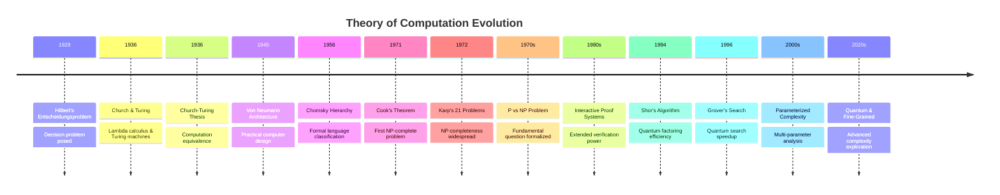

```mermaid
timeline
    title Theory of Computation Evolution
    1928 : Hilbert's Entscheidungsproblem
         : Decision problem posed
    1936 : Church & Turing
         : Lambda calculus & Turing machines
    1936 : Church-Turing Thesis
         : Computation equivalence
    1945 : Von Neumann Architecture
         : Practical computer design
    1956 : Chomsky Hierarchy
         : Formal language classification
    1971 : Cook's Theorem
         : First NP-complete problem
    1972 : Karp's 21 Problems
         : NP-completeness widespread
    1970s : P vs NP Problem
          : Fundamental question formalized
    1980s : Interactive Proof Systems
          : Extended verification power
    1994 : Shor's Algorithm
         : Quantum factoring efficiency
    1996 : Grover's Search
         : Quantum search speedup
    2000s : Parameterized Complexity
          : Multi-parameter analysis
    2020s : Quantum & Fine-Grained
          : Advanced complexity exploration
```
