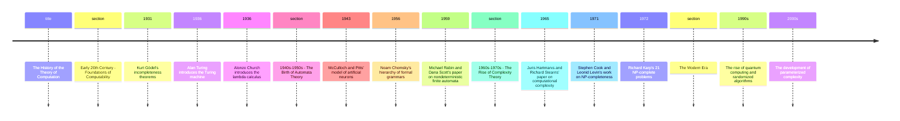

```mermaid
timeline
    title: The History of the Theory of Computation
    section: Early 20th Century - Foundations of Computability
        1931: Kurt Gödel's incompleteness theorems
        1936: Alan Turing introduces the Turing machine
        1936: Alonzo Church introduces the lambda calculus
    section: 1940s-1950s - The Birth of Automata Theory
        1943: McCulloch and Pitts' model of artificial neurons
        1956: Noam Chomsky's hierarchy of formal grammars
        1959: Michael Rabin and Dana Scott's paper on nondeterministic finite automata
    section: 1960s-1970s - The Rise of Complexity Theory
        1965: Juris Hartmanis and Richard Stearns' paper on computational complexity
        1971: Stephen Cook and Leonid Levin's work on NP-completeness
        1972: Richard Karp's 21 NP-complete problems
    section: The Modern Era
        1990s: The rise of quantum computing and randomized algorithms
        2000s: The development of parameterized complexity
```
