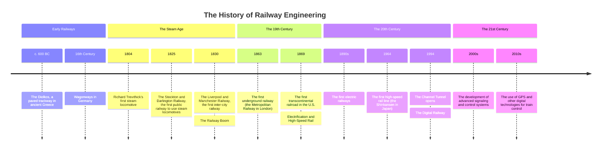

```mermaid
timeline
    title The History of Railway Engineering
    section Early Railways
        c. 600 BC : The Diolkos, a paved trackway in ancient Greece
        16th Century : Wagonways in Germany
    section The Steam Age
        1804 : Richard Trevithick's first steam locomotive
        1825 : The Stockton and Darlington Railway, the first public railway to use steam locomotives
        1830 : The Liverpool and Manchester Railway, the first inter-city railway
    section The 19th Century: The Railway Boom
        1863 : The first underground railway (the Metropolitan Railway in London)
        1869 : The first transcontinental railroad in the U.S.
    section The 20th Century: Electrification and High-Speed Rail
        1890s : The first electric railways
        1964 : The first high-speed rail line (the Shinkansen in Japan)
        1994 : The Channel Tunnel opens
    section The 21st Century: The Digital Railway
        2000s : The development of advanced signaling and control systems
        2010s : The use of GPS and other digital technologies for train control
```
