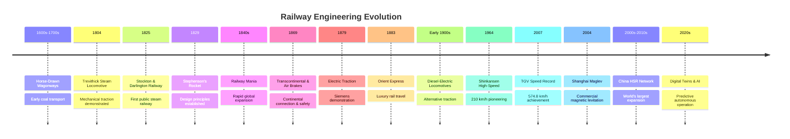

```mermaid
timeline
    title Railway Engineering Evolution
    1600s-1700s : Horse-Drawn Wagonways
                : Early coal transport
    1804 : Trevithick Steam Locomotive
         : Mechanical traction demonstrated
    1825 : Stockton & Darlington Railway
         : First public steam railway
    1829 : Stephenson's Rocket
         : Design principles established
    1840s : Railway Mania
          : Rapid global expansion
    1869 : Transcontinental & Air Brakes
         : Continental connection & safety
    1879 : Electric Traction
         : Siemens demonstration
    1883 : Orient Express
         : Luxury rail travel
    Early 1900s : Diesel-Electric Locomotives
                : Alternative traction
    1964 : Shinkansen High-Speed
         : 210 km/h pioneering
    2007 : TGV Speed Record
         : 574.8 km/h achievement
    2004 : Shanghai Maglev
         : Commercial magnetic levitation
    2000s-2010s : China HSR Network
                : World's largest expansion
    2020s : Digital Twins & AI
          : Predictive autonomous operation
```
