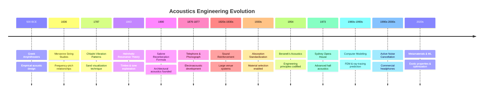

```mermaid
timeline
    title Acoustics Engineering Evolution
    500 BCE : Greek Amphitheaters
            : Empirical acoustic design
    1636 : Mersenne String Studies
         : Frequency-pitch relationships
    1787 : Chladni Vibration Patterns
         : Sand visualization technique
    1863 : Helmholtz Resonance Theory
         : Timbre & tone explanation
    1900 : Sabine Reverberation Formula
         : Architectural acoustics founded
    1876-1877 : Telephone & Phonograph
              : Electroacoustic development
    1920s-1930s : Sound Reinforcement
                : Large venue systems
    1930s : Absorption Standardization
          : Material selection enabled
    1954 : Beranek's Acoustics
         : Engineering principles codified
    1973 : Sydney Opera House
         : Advanced hall acoustics
    1980s-1990s : Computer Modeling
                : FEM & ray-tracing prediction
    1990s-2000s : Active Noise Cancellation
                : Commercial headphones
    2020s : Metamaterials & ML
          : Exotic properties & optimization
```
