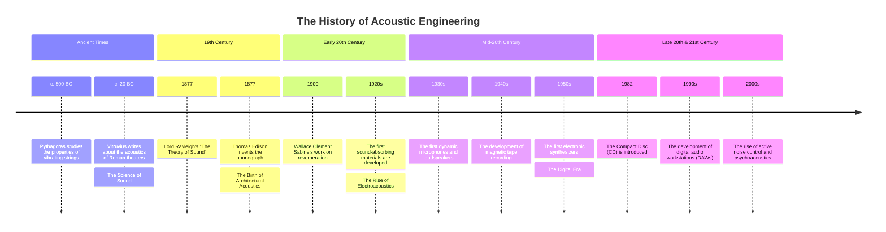

```mermaid
timeline
    title The History of Acoustic Engineering
    section Ancient Times
        c. 500 BC : Pythagoras studies the properties of vibrating strings
        c. 20 BC : Vitruvius writes about the acoustics of Roman theaters
    section 19th Century: The Science of Sound
        1877 : Lord Rayleigh's "The Theory of Sound"
        1877 : Thomas Edison invents the phonograph
    section Early 20th Century: The Birth of Architectural Acoustics
        1900 : Wallace Clement Sabine's work on reverberation
        1920s : The first sound-absorbing materials are developed
    section Mid-20th Century: The Rise of Electroacoustics
        1930s : The first dynamic microphones and loudspeakers
        1940s : The development of magnetic tape recording
        1950s : The first electronic synthesizers
    section Late 20th & 21st Century: The Digital Era
        1982 : The Compact Disc (CD) is introduced
        1990s : The development of digital audio workstations (DAWs)
        2000s : The rise of active noise control and psychoacoustics
```
