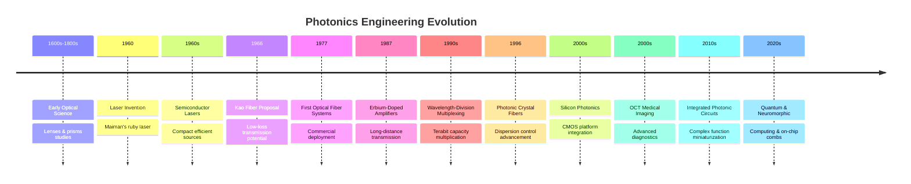

```mermaid
timeline
    title Photonics Engineering Evolution
    1600s-1800s : Early Optical Science
                : Lenses & prisms studies
    1960 : Laser Invention
         : Maiman's ruby laser
    1960s : Semiconductor Lasers
          : Compact efficient sources
    1966 : Kao Fiber Proposal
         : Low-loss transmission potential
    1977 : First Optical Fiber Systems
         : Commercial deployment
    1987 : Erbium-Doped Amplifiers
         : Long-distance transmission
    1990s : Wavelength-Division Multiplexing
          : Terabit capacity multiplication
    1996 : Photonic Crystal Fibers
         : Dispersion control advancement
    2000s : Silicon Photonics
          : CMOS platform integration
    2000s : OCT Medical Imaging
          : Advanced diagnostics
    2010s : Integrated Photonic Circuits
          : Complex function miniaturization
    2020s : Quantum & Neuromorphic
          : Computing & on-chip combs
```
