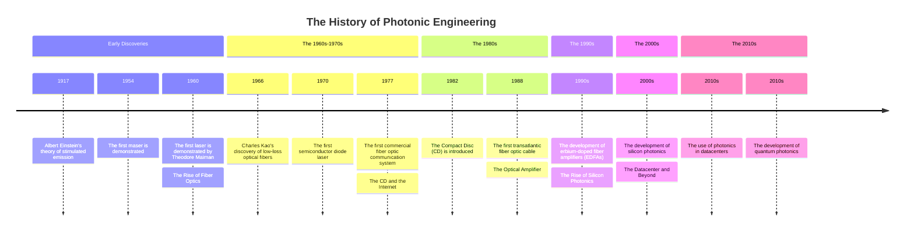

```mermaid
timeline
    title The History of Photonic Engineering
    section Early Discoveries
        1917 : Albert Einstein's theory of stimulated emission
        1954 : The first maser is demonstrated
        1960 : The first laser is demonstrated by Theodore Maiman
    section The 1960s-1970s: The Rise of Fiber Optics
        1966 : Charles Kao's discovery of low-loss optical fibers
        1970 : The first semiconductor diode laser
        1977 : The first commercial fiber optic communication system
    section The 1980s: The CD and the Internet
        1982 : The Compact Disc (CD) is introduced
        1988 : The first transatlantic fiber optic cable
    section The 1990s: The Optical Amplifier
        1990s : The development of erbium-doped fiber amplifiers (EDFAs)
    section The 2000s: The Rise of Silicon Photonics
        2000s : The development of silicon photonics
    section The 2010s: The Datacenter and Beyond
        2010s : The use of photonics in datacenters
        2010s : The development of quantum photonics
```
