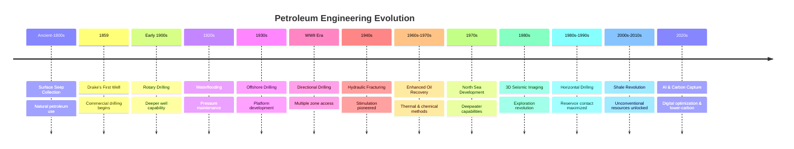

```mermaid
timeline
    title Petroleum Engineering Evolution
    Ancient-1800s : Surface Seep Collection
                  : Natural petroleum use
    1859 : Drake's First Well
         : Commercial drilling begins
    Early 1900s : Rotary Drilling
                : Deeper well capability
    1920s : Waterflooding
          : Pressure maintenance
    1930s : Offshore Drilling
          : Platform development
    WWII Era : Directional Drilling
             : Multiple zone access
    1940s : Hydraulic Fracturing
          : Stimulation pioneered
    1960s-1970s : Enhanced Oil Recovery
                : Thermal & chemical methods
    1970s : North Sea Development
          : Deepwater capabilities
    1980s : 3D Seismic Imaging
          : Exploration revolution
    1980s-1990s : Horizontal Drilling
                : Reservoir contact maximized
    2000s-2010s : Shale Revolution
                : Unconventional resources unlocked
    2020s : AI & Carbon Capture
          : Digital optimization & lower-carbon
```
