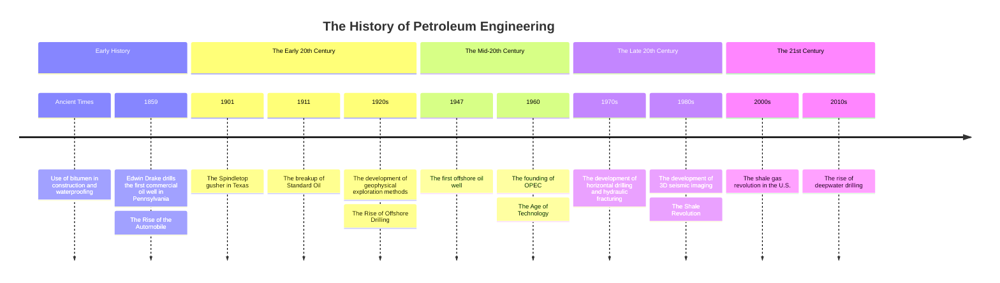

```mermaid
timeline
    title The History of Petroleum Engineering
    section Early History
        Ancient Times : Use of bitumen in construction and waterproofing
        1859 : Edwin Drake drills the first commercial oil well in Pennsylvania
    section The Early 20th Century: The Rise of the Automobile
        1901 : The Spindletop gusher in Texas
        1911 : The breakup of Standard Oil
        1920s : The development of geophysical exploration methods
    section The Mid-20th Century: The Rise of Offshore Drilling
        1947 : The first offshore oil well
        1960 : The founding of OPEC
    section The Late 20th Century: The Age of Technology
        1970s : The development of horizontal drilling and hydraulic fracturing
        1980s : The development of 3D seismic imaging
    section The 21st Century: The Shale Revolution
        2000s : The shale gas revolution in the U.S.
        2010s : The rise of deepwater drilling
```
