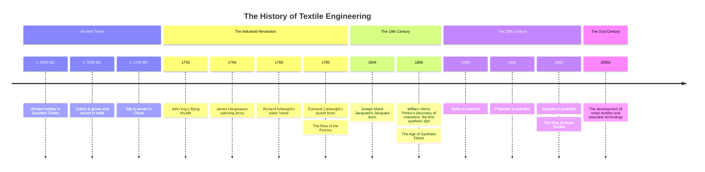

```mermaid
timeline
    title The History of Textile Engineering
    section Ancient Times
        c. 6000 BC : Woolen textiles in Southern Turkey
        c. 5000 BC : Cotton is grown and woven in India
        c. 2700 BC : Silk is woven in China
    section The Industrial Revolution
        1733 : John Kay's flying shuttle
        1764 : James Hargreaves' spinning jenny
        1769 : Richard Arkwright's water frame
        1785 : Edmund Cartwright's power loom
    section The 19th Century: The Rise of the Factory
        1804 : Joseph Marie Jacquard's Jacquard loom
        1856 : William Henry Perkin's discovery of mauveine, the first synthetic dye
    section The 20th Century: The Age of Synthetic Fibers
        1938 : Nylon is invented
        1941 : Polyester is invented
        1953 : Spandex is invented
    section The 21st Century: The Rise of Smart Textiles
        2000s : The development of smart textiles and wearable technology
```
