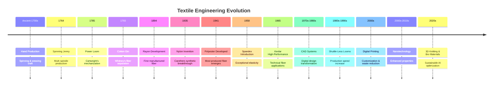

```mermaid
timeline
    title Textile Engineering Evolution
    Ancient-1700s : Hand Production
                  : Spinning & weaving craft
    1764 : Spinning Jenny
         : Multi-spindle production
    1785 : Power Loom
         : Cartwright's mechanization
    1793 : Cotton Gin
         : Whitney's fiber separation
    1894 : Rayon Development
         : First manufactured fiber
    1935 : Nylon Invention
         : Carothers synthetic breakthrough
    1941 : Polyester Developed
         : Most-produced fiber emerges
    1958 : Spandex Introduction
         : Exceptional elasticity
    1965 : Kevlar High-Performance
         : Technical fiber applications
    1970s-1980s : CAD Systems
                : Digital design transformation
    1980s-1990s : Shuttle-Less Looms
                : Production speed increase
    2000s : Digital Printing
          : Customization & waste reduction
    2000s-2010s : Nanotechnology
                : Enhanced properties
    2020s : 3D Knitting & Bio-Materials
          : Sustainable AI optimization
```
