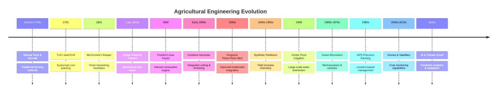

```mermaid
timeline
    title Agricultural Engineering Evolution
    Ancient-1700s : Manual Tools & Animals
                  : Traditional farming methods
    1701 : Tull's Seed Drill
         : Systematic row planting
    1831 : McCormick's Reaper
         : Grain harvesting revolution
    Late 1800s : Steam-Powered Tractors
               : Mechanical farm power
    1892 : Froelich's Gas Tractor
         : Internal combustion engine
    Early 1900s : Combine Harvester
                : Integrated cutting & threshing
    1930s : Ferguson Three-Point Hitch
          : Improved implement integration
    1940s-1950s : Synthetic Fertilizers
                : Yield increase chemistry
    1948 : Center Pivot Irrigation
         : Large-scale water distribution
    1960s-1970s : Green Revolution
                : Mechanization & varieties
    1990s : GPS Precision Farming
          : Location-based management
    2000s-2010s : Drones & Satellites
                : Crop monitoring capabilities
    2020s : AI & Climate-Smart
          : Predictive analytics & adaptation
```
