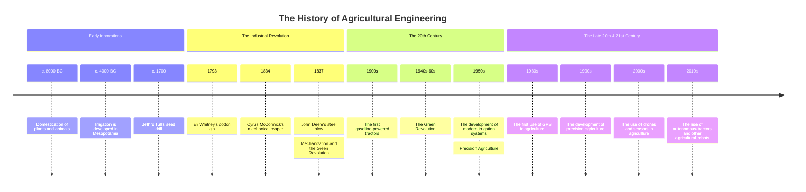

```mermaid
timeline
    title The History of Agricultural Engineering
    section Early Innovations
        c. 8000 BC : Domestication of plants and animals
        c. 4000 BC : Irrigation is developed in Mesopotamia
        c. 1700 : Jethro Tull's seed drill
    section The Industrial Revolution
        1793 : Eli Whitney's cotton gin
        1834 : Cyrus McCormick's mechanical reaper
        1837 : John Deere's steel plow
    section The 20th Century: Mechanization and the Green Revolution
        1900s : The first gasoline-powered tractors
        1940s-60s : The Green Revolution
        1950s : The development of modern irrigation systems
    section The Late 20th & 21st Century: Precision Agriculture
        1980s : The first use of GPS in agriculture
        1990s : The development of precision agriculture
        2000s : The use of drones and sensors in agriculture
        2010s : The rise of autonomous tractors and other agricultural robots
```
