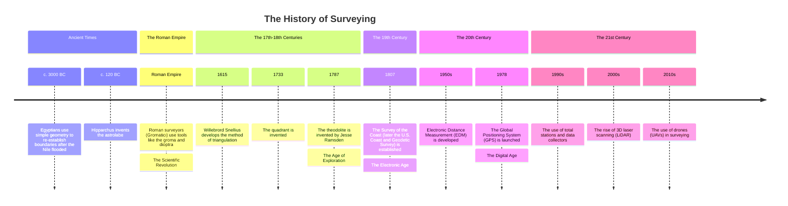

```mermaid
timeline
    title The History of Surveying
    section Ancient Times
        c. 3000 BC : Egyptians use simple geometry to re-establish boundaries after the Nile flooded
        c. 120 BC : Hipparchus invents the astrolabe
    section The Roman Empire
        Roman Empire : Roman surveyors (Gromatici) use tools like the groma and dioptra
    section The 17th-18th Centuries: The Scientific Revolution
        1615 : Willebrord Snellius develops the method of triangulation
        1733 : The quadrant is invented
        1787 : The theodolite is invented by Jesse Ramsden
    section The 19th Century: The Age of Exploration
        1807 : The Survey of the Coast (later the U.S. Coast and Geodetic Survey) is established
    section The 20th Century: The Electronic Age
        1950s : Electronic Distance Measurement (EDM) is developed
        1978 : The Global Positioning System (GPS) is launched
    section The 21st Century: The Digital Age
        1990s : The use of total stations and data collectors
        2000s : The rise of 3D laser scanning (LiDAR)
        2010s : The use of drones (UAVs) in surveying
```
