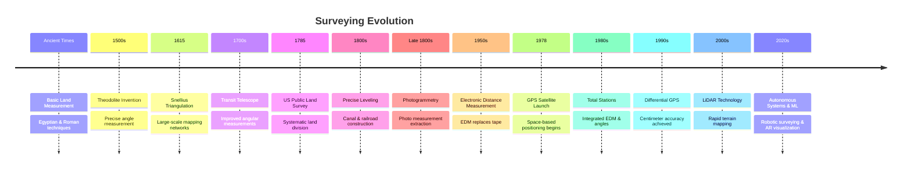

```mermaid
timeline
    title Surveying Evolution
    Ancient Times : Basic Land Measurement
                  : Egyptian & Roman techniques
    1500s : Theodolite Invention
          : Precise angle measurement
    1615 : Snellius Triangulation
         : Large-scale mapping networks
    1700s : Transit Telescope
          : Improved angular measurements
    1785 : US Public Land Survey
         : Systematic land division
    1800s : Precise Leveling
          : Canal & railroad construction
    Late 1800s : Photogrammetry
               : Photo measurement extraction
    1950s : Electronic Distance Measurement
          : EDM replaces tape
    1978 : GPS Satellite Launch
         : Space-based positioning begins
    1980s : Total Stations
          : Integrated EDM & angles
    1990s : Differential GPS
          : Centimeter accuracy achieved
    2000s : LiDAR Technology
          : Rapid terrain mapping
    2020s : Autonomous Systems & ML
          : Robotic surveying & AR visualization
```
