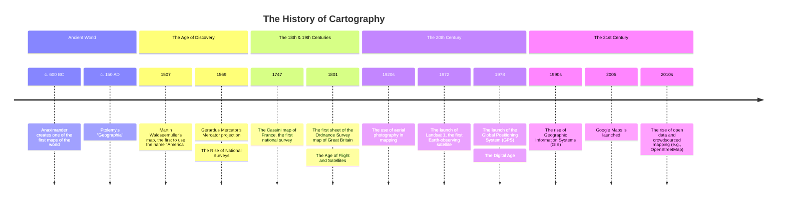

```mermaid
timeline
    title The History of Cartography
    section Ancient World
        c. 600 BC : Anaximander creates one of the first maps of the world
        c. 150 AD : Ptolemy's "Geographia"
    section The Age of Discovery
        1507 : Martin Waldseemüller's map, the first to use the name "America"
        1569 : Gerardus Mercator's Mercator projection
    section The 18th & 19th Centuries: The Rise of National Surveys
        1747 : The Cassini map of France, the first national survey
        1801 : The first sheet of the Ordnance Survey map of Great Britain
    section The 20th Century: The Age of Flight and Satellites
        1920s : The use of aerial photography in mapping
        1972 : The launch of Landsat 1, the first Earth-observing satellite
        1978 : The launch of the Global Positioning System (GPS)
    section The 21st Century: The Digital Age
        1990s : The rise of Geographic Information Systems (GIS)
        2005 : Google Maps is launched
        2010s : The rise of open data and crowdsourced mapping (e.g., OpenStreetMap)
```
