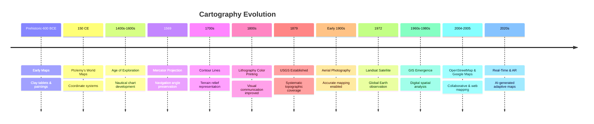

```mermaid
timeline
    title Cartography Evolution
    Prehistoric-600 BCE : Early Maps
                       : Clay tablets & paintings
    150 CE : Ptolemy's World Maps
           : Coordinate systems
    1400s-1600s : Age of Exploration
                : Nautical chart development
    1569 : Mercator Projection
         : Navigation angle preservation
    1700s : Contour Lines
          : Terrain relief representation
    1800s : Lithography Color Printing
          : Visual communication improved
    1879 : USGS Established
         : Systematic topographic coverage
    Early 1900s : Aerial Photography
                : Accurate mapping enabled
    1972 : Landsat Satellite
         : Global Earth observation
    1960s-1980s : GIS Emergence
                : Digital spatial analysis
    2004-2005 : OpenStreetMap & Google Maps
              : Collaborative & web mapping
    2020s : Real-Time & AR
          : AI-generated adaptive maps
```
