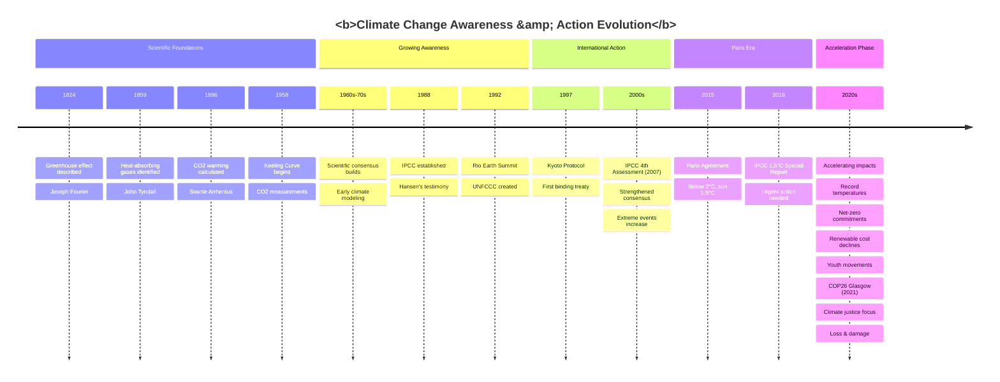

```mermaid
timeline
    title <b>Climate Change Awareness & Action Evolution</b>
    
    section Scientific Foundations
        1824  : Greenhouse effect described
              : Joseph Fourier
        1859  : Heat-absorbing gases identified
              : John Tyndall
        1896  : CO2 warming calculated
              : Svante Arrhenius
        1958  : Keeling Curve begins
              : CO2 measurements
    
    section Growing Awareness
        1960s-70s : Scientific consensus builds
                  : Early climate modeling
        1988  : IPCC established
              : Hansen's testimony
        1992  : Rio Earth Summit
              : UNFCCC created
    
    section International Action
        1997  : Kyoto Protocol
              : First binding treaty
        2000s : IPCC 4th Assessment (2007)
              : Strengthened consensus
              : Extreme events increase
    
    section Paris Era
        2015  : Paris Agreement
              : Below 2°C, aim 1.5°C
        2018  : IPCC 1.5°C Special Report
              : Urgent action needed
    
    section Acceleration Phase
        2020s : Accelerating impacts
              : Record temperatures
              : Net-zero commitments
              : Renewable cost declines
              : Youth movements
              : COP26 Glasgow (2021)
              : Climate justice focus
              : Loss & damage
```
