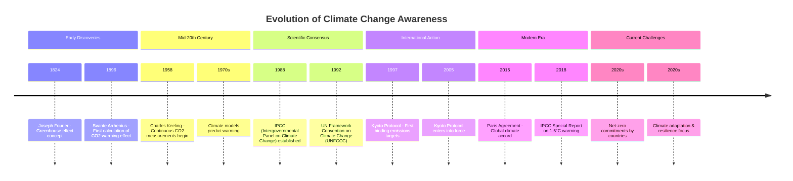

```mermaid
timeline
    title Evolution of Climate Change Awareness
    section Early Discoveries
        1824 : Joseph Fourier - Greenhouse effect concept
        1896 : Svante Arrhenius - First calculation of CO2 warming effect
    section Mid-20th Century
        1958 : Charles Keeling - Continuous CO2 measurements begin
        1970s : Climate models predict warming
    section Scientific Consensus
        1988 : IPCC (Intergovernmental Panel on Climate Change) established
        1992 : UN Framework Convention on Climate Change (UNFCCC)
    section International Action
        1997 : Kyoto Protocol - First binding emissions targets
        2005 : Kyoto Protocol enters into force
    section Modern Era
        2015 : Paris Agreement - Global climate accord
        2018 : IPCC Special Report on 1.5°C warming
    section Current Challenges
        2020s : Net-zero commitments by countries
        2020s : Climate adaptation & resilience focus
```
