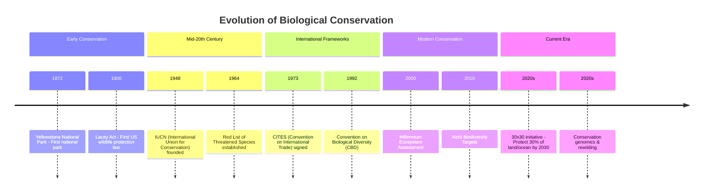

```mermaid
timeline
    title Evolution of Biological Conservation
    section Early Conservation
        1872 : Yellowstone National Park - First national park
        1900 : Lacey Act - First US wildlife protection law
    section Mid-20th Century
        1948 : IUCN (International Union for Conservation) founded
        1964 : Red List of Threatened Species established
    section International Frameworks
        1973 : CITES (Convention on International Trade) signed
        1992 : Convention on Biological Diversity (CBD)
    section Modern Conservation
        2000 : Millennium Ecosystem Assessment
        2010 : Aichi Biodiversity Targets
    section Current Era
        2020s : 30x30 initiative - Protect 30% of land/ocean by 2030
        2020s : Conservation genomics & rewilding
```
