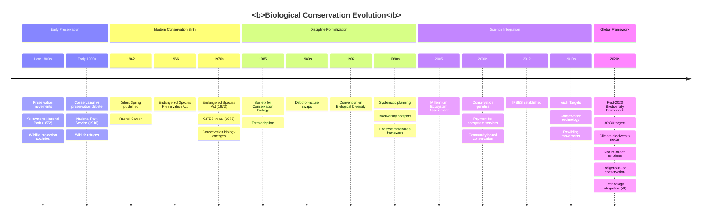

```mermaid
timeline
    title <b>Biological Conservation Evolution</b>
    
    section Early Preservation
        Late 1800s : Preservation movements
                   : Yellowstone National Park (1872)
                   : Wildlife protection societies
        Early 1900s : Conservation vs preservation debate
                    : National Park Service (1916)
                    : Wildlife refuges
    
    section Modern Conservation Birth
        1962  : Silent Spring published
              : Rachel Carson
        1966  : Endangered Species Preservation Act
        1970s : Endangered Species Act (1973)
              : CITES treaty (1975)
              : Conservation biology emerges
    
    section Discipline Formalization
        1985  : Society for Conservation Biology
              : Term adoption
        1980s : Debt-for-nature swaps
        1992  : Convention on Biological Diversity
        1990s : Systematic planning
              : Biodiversity hotspots
              : Ecosystem services framework
    
    section Science Integration
        2005  : Millennium Ecosystem Assessment
        2000s : Conservation genetics
              : Payment for ecosystem services
              : Community-based conservation
        2012  : IPBES established
        2010s : Aichi Targets
              : Conservation technology
              : Rewilding movements
    
    section Global Framework
        2020s : Post-2020 Biodiversity Framework
              : 30x30 targets
              : Climate-biodiversity nexus
              : Nature-based solutions
              : Indigenous-led conservation
              : Technology integration (AI)
```
