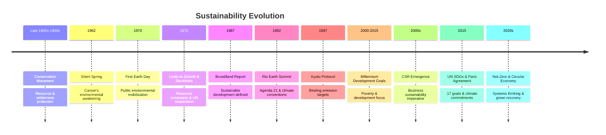

```mermaid
timeline
    title Sustainability Evolution
    Late 1800s-1900s : Conservation Movement
                     : Resource & wilderness protection
    1962 : Silent Spring
         : Carson's environmental awakening
    1970 : First Earth Day
         : Public environmental mobilization
    1972 : Limits to Growth & Stockholm
         : Resource constraints & UN cooperation
    1987 : Brundtland Report
         : Sustainable development defined
    1992 : Rio Earth Summit
         : Agenda 21 & climate conventions
    1997 : Kyoto Protocol
         : Binding emission targets
    2000-2015 : Millennium Development Goals
              : Poverty & development focus
    2000s : CSR Emergence
          : Business sustainability imperative
    2015 : UN SDGs & Paris Agreement
         : 17 goals & climate commitments
    2020s : Net-Zero & Circular Economy
          : Systems thinking & green recovery
```
