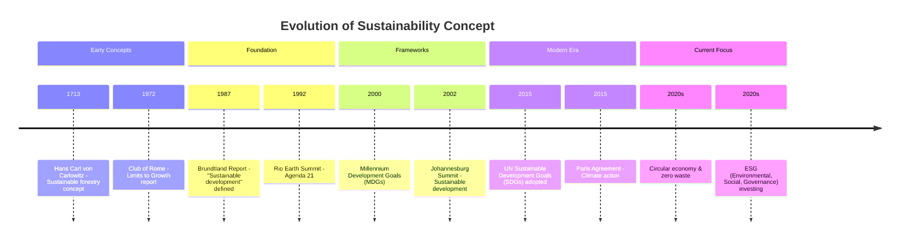

```mermaid
timeline
    title Evolution of Sustainability Concept
    section Early Concepts
        1713 : Hans Carl von Carlowitz - Sustainable forestry concept
        1972 : Club of Rome - Limits to Growth report
    section Foundation
        1987 : Brundtland Report - "Sustainable development" defined
        1992 : Rio Earth Summit - Agenda 21
    section Frameworks
        2000 : Millennium Development Goals (MDGs)
        2002 : Johannesburg Summit - Sustainable development
    section Modern Era
        2015 : UN Sustainable Development Goals (SDGs) adopted
        2015 : Paris Agreement - Climate action
    section Current Focus
        2020s : Circular economy & zero waste
        2020s : ESG (Environmental, Social, Governance) investing
```
