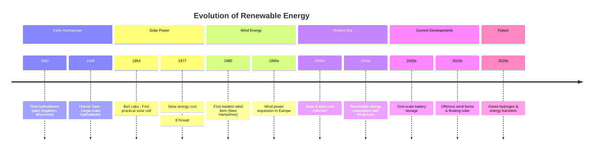

```mermaid
timeline
    title Evolution of Renewable Energy
    section Early Hydropower
        1882 : First hydroelectric plant (Appleton, Wisconsin)
        1936 : Hoover Dam - Large-scale hydroelectric
    section Solar Power
        1954 : Bell Labs - First practical solar cell
        1977 : Solar energy cost: $76/watt
    section Wind Energy
        1980 : First modern wind farm (New Hampshire)
        1990s : Wind power expansion in Europe
    section Modern Era
        2000s : Solar & wind cost reduction
        2010s : Renewable energy competitive with fossil fuels
    section Current Developments
        2020s : Grid-scale battery storage
        2020s : Offshore wind farms & floating solar
    section Future
        2020s : Green hydrogen & energy transition
```
