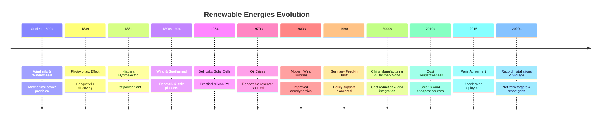

```mermaid
timeline
    title Renewable Energies Evolution
    Ancient-1800s : Windmills & Waterwheels
                  : Mechanical power provision
    1839 : Photovoltaic Effect
         : Becquerel's discovery
    1881 : Niagara Hydroelectric
         : First power plant
    1890s-1904 : Wind & Geothermal
               : Denmark & Italy pioneers
    1954 : Bell Labs Solar Cells
         : Practical silicon PV
    1970s : Oil Crises
          : Renewable research spurred
    1980s : Modern Wind Turbines
          : Improved aerodynamics
    1990 : Germany Feed-in Tariff
         : Policy support pioneered
    2000s : China Manufacturing & Denmark Wind
          : Cost reduction & grid integration
    2010s : Cost Competitiveness
          : Solar & wind cheapest sources
    2015 : Paris Agreement
         : Accelerated deployment
    2020s : Record Installations & Storage
          : Net-zero targets & smart grids
```
