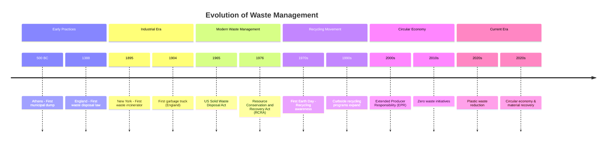

```mermaid
timeline
    title Evolution of Waste Management
    section Early Practices
        500 BC : Athens - First municipal dump
        1388 : England - First waste disposal law
    section Industrial Era
        1895 : New York - First waste incinerator
        1904 : First garbage truck (England)
    section Modern Waste Management
        1965 : US Solid Waste Disposal Act
        1976 : Resource Conservation and Recovery Act (RCRA)
    section Recycling Movement
        1970s : First Earth Day - Recycling awareness
        1990s : Curbside recycling programs expand
    section Circular Economy
        2000s : Extended Producer Responsibility (EPR)
        2010s : Zero waste initiatives
    section Current Era
        2020s : Plastic waste reduction
        2020s : Circular economy & material recovery
```
