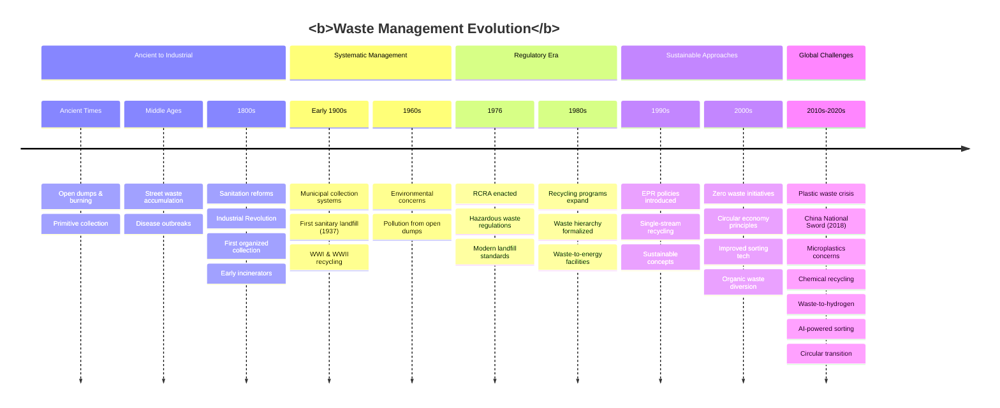

```mermaid
timeline
    title <b>Waste Management Evolution</b>
    
    section Ancient to Industrial
        Ancient Times : Open dumps & burning
                      : Primitive collection
        Middle Ages : Street waste accumulation
                    : Disease outbreaks
        1800s : Sanitation reforms
              : Industrial Revolution
              : First organized collection
              : Early incinerators
    
    section Systematic Management
        Early 1900s : Municipal collection systems
                    : First sanitary landfill (1937)
                    : WWI & WWII recycling
        1960s : Environmental concerns
              : Pollution from open dumps
    
    section Regulatory Era
        1976  : RCRA enacted
              : Hazardous waste regulations
              : Modern landfill standards
        1980s : Recycling programs expand
              : Waste hierarchy formalized
              : Waste-to-energy facilities
    
    section Sustainable Approaches
        1990s : EPR policies introduced
              : Single-stream recycling
              : Sustainable concepts
        2000s : Zero waste initiatives
              : Circular economy principles
              : Improved sorting tech
              : Organic waste diversion
    
    section Global Challenges
        2010s-2020s : Plastic waste crisis
                    : China National Sword (2018)
                    : Microplastics concerns
                    : Chemical recycling
                    : Waste-to-hydrogen
                    : AI-powered sorting
                    : Circular transition
```
