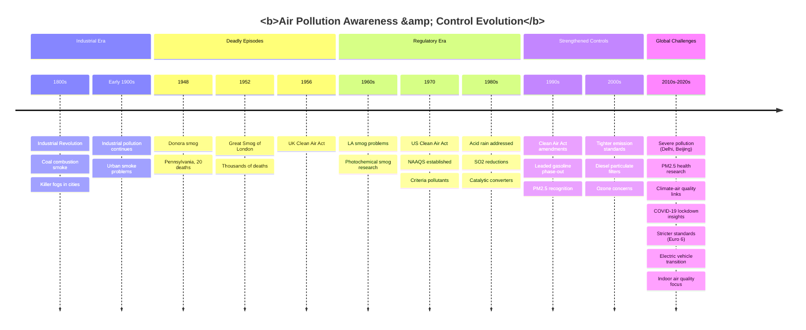

```mermaid
timeline
    title <b>Air Pollution Awareness & Control Evolution</b>
    
    section Industrial Era
        1800s : Industrial Revolution
              : Coal combustion smoke
              : Killer fogs in cities
        Early 1900s : Industrial pollution continues
                    : Urban smoke problems
    
    section Deadly Episodes
        1948  : Donora smog
              : Pennsylvania, 20 deaths
        1952  : Great Smog of London
              : Thousands of deaths
        1956  : UK Clean Air Act
    
    section Regulatory Era
        1960s : LA smog problems
              : Photochemical smog research
        1970  : US Clean Air Act
              : NAAQS established
              : Criteria pollutants
        1980s : Acid rain addressed
              : SO2 reductions
              : Catalytic converters
    
    section Strengthened Controls
        1990s : Clean Air Act amendments
              : Leaded gasoline phase-out
              : PM2.5 recognition
        2000s : Tighter emission standards
              : Diesel particulate filters
              : Ozone concerns
    
    section Global Challenges
        2010s-2020s : Severe pollution (Delhi, Beijing)
                    : PM2.5 health research
                    : Climate-air quality links
                    : COVID-19 lockdown insights
                    : Stricter standards (Euro 6)
                    : Electric vehicle transition
                    : Indoor air quality focus
```
