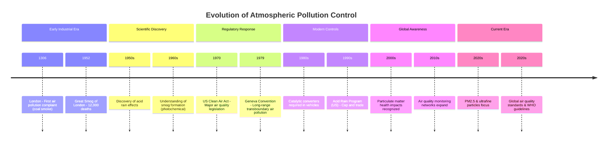

```mermaid
timeline
    title Evolution of Atmospheric Pollution Control
    section Early Industrial Era
        1306 : London - First air pollution complaint (coal smoke)
        1952 : Great Smog of London - 12,000 deaths
    section Scientific Discovery
        1950s : Discovery of acid rain effects
        1960s : Understanding of smog formation (photochemical)
    section Regulatory Response
        1970 : US Clean Air Act - Major air quality legislation
        1979 : Geneva Convention - Long-range transboundary air pollution
    section Modern Controls
        1980s : Catalytic converters required in vehicles
        1990s : Acid Rain Program (US) - Cap and trade
    section Global Awareness
        2000s : Particulate matter health impacts recognized
        2010s : Air quality monitoring networks expand
    section Current Era
        2020s : PM2.5 & ultrafine particles focus
        2020s : Global air quality standards & WHO guidelines
```
