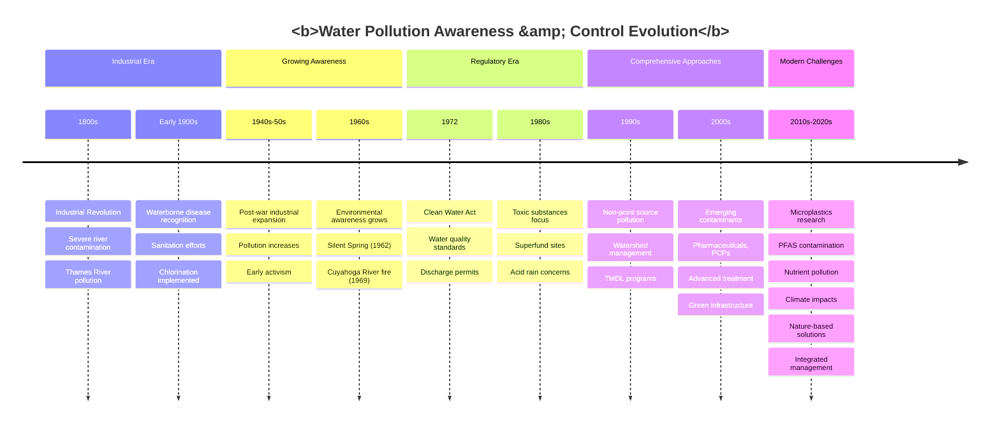

```mermaid
timeline
    title <b>Water Pollution Awareness & Control Evolution</b>
    
    section Industrial Era
        1800s : Industrial Revolution
              : Severe river contamination
              : Thames River pollution
        Early 1900s : Waterborne disease recognition
                    : Sanitation efforts
                    : Chlorination implemented
    
    section Growing Awareness
        1940s-50s : Post-war industrial expansion
                  : Pollution increases
                  : Early activism
        1960s : Environmental awareness grows
              : Silent Spring (1962)
              : Cuyahoga River fire (1969)
    
    section Regulatory Era
        1972  : Clean Water Act
              : Water quality standards
              : Discharge permits
        1980s : Toxic substances focus
              : Superfund sites
              : Acid rain concerns
    
    section Comprehensive Approaches
        1990s : Non-point source pollution
              : Watershed management
              : TMDL programs
        2000s : Emerging contaminants
              : Pharmaceuticals, PCPs
              : Advanced treatment
              : Green infrastructure
    
    section Modern Challenges
        2010s-2020s : Microplastics research
                    : PFAS contamination
                    : Nutrient pollution
                    : Climate impacts
                    : Nature-based solutions
                    : Integrated management
```
