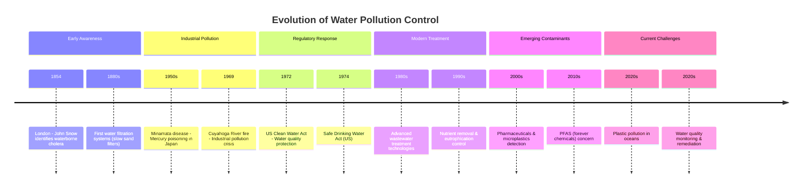

```mermaid
timeline
    title Evolution of Water Pollution Control
    section Early Awareness
        1854 : London - John Snow identifies waterborne cholera
        1880s : First water filtration systems (slow sand filters)
    section Industrial Pollution
        1950s : Minamata disease - Mercury poisoning in Japan
        1969 : Cuyahoga River fire - Industrial pollution crisis
    section Regulatory Response
        1972 : US Clean Water Act - Water quality protection
        1974 : Safe Drinking Water Act (US)
    section Modern Treatment
        1980s : Advanced wastewater treatment technologies
        1990s : Nutrient removal & eutrophication control
    section Emerging Contaminants
        2000s : Pharmaceuticals & microplastics detection
        2010s : PFAS (forever chemicals) concern
    section Current Challenges
        2020s : Plastic pollution in oceans
        2020s : Water quality monitoring & remediation
```
