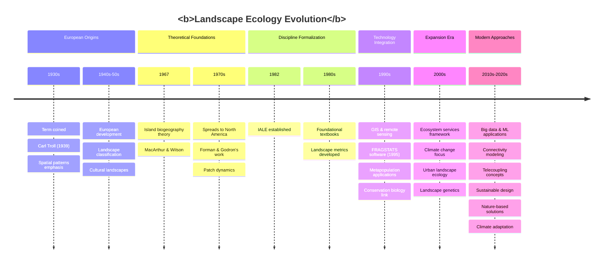

```mermaid
timeline
    title <b>Landscape Ecology Evolution</b>
    
    section European Origins
        1930s : Term coined
              : Carl Troll (1939)
              : Spatial patterns emphasis
        1940s-50s : European development
                  : Landscape classification
                  : Cultural landscapes
    
    section Theoretical Foundations
        1967  : Island biogeography theory
              : MacArthur & Wilson
        1970s : Spreads to North America
              : Forman & Godron's work
              : Patch dynamics
    
    section Discipline Formalization
        1982  : IALE established
        1980s : Foundational textbooks
              : Landscape metrics developed
    
    section Technology Integration
        1990s : GIS & remote sensing
              : FRAGSTATS software (1995)
              : Metapopulation applications
              : Conservation biology link
    
    section Expansion Era
        2000s : Ecosystem services framework
              : Climate change focus
              : Urban landscape ecology
              : Landscape genetics
    
    section Modern Approaches
        2010s-2020s : Big data & ML applications
                    : Connectivity modeling
                    : Telecoupling concepts
                    : Sustainable design
                    : Nature-based solutions
                    : Climate adaptation
```
