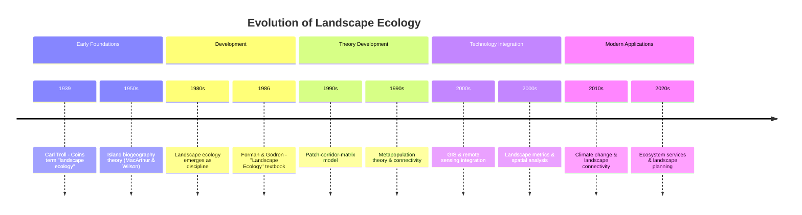

```mermaid
timeline
    title Evolution of Landscape Ecology
    section Early Foundations
        1939 : Carl Troll - Coins term "landscape ecology"
        1950s : Island biogeography theory (MacArthur & Wilson)
    section Development
        1980s : Landscape ecology emerges as discipline
        1986 : Forman & Godron - "Landscape Ecology" textbook
    section Theory Development
        1990s : Patch-corridor-matrix model
        1990s : Metapopulation theory & connectivity
    section Technology Integration
        2000s : GIS & remote sensing integration
        2000s : Landscape metrics & spatial analysis
    section Modern Applications
        2010s : Climate change & landscape connectivity
        2020s : Ecosystem services & landscape planning
```
