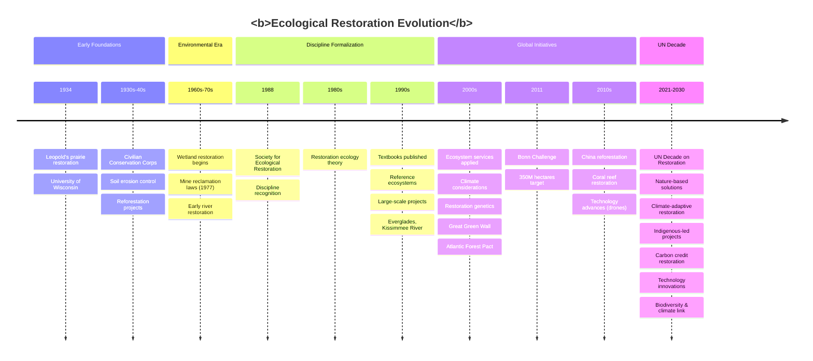

```mermaid
timeline
    title <b>Ecological Restoration Evolution</b>
    
    section Early Foundations
        1934  : Leopold's prairie restoration
              : University of Wisconsin
        1930s-40s : Civilian Conservation Corps
                  : Soil erosion control
                  : Reforestation projects
    
    section Environmental Era
        1960s-70s : Wetland restoration begins
                  : Mine reclamation laws (1977)
                  : Early river restoration
    
    section Discipline Formalization
        1988  : Society for Ecological Restoration
              : Discipline recognition
        1980s : Restoration ecology theory
        1990s : Textbooks published
              : Reference ecosystems
              : Large-scale projects
              : Everglades, Kissimmee River
    
    section Global Initiatives
        2000s : Ecosystem services applied
              : Climate considerations
              : Restoration genetics
              : Great Green Wall
              : Atlantic Forest Pact
        2011  : Bonn Challenge
              : 350M hectares target
        2010s : China reforestation
              : Coral reef restoration
              : Technology advances (drones)
    
    section UN Decade
        2021-2030 : UN Decade on Restoration
                  : Nature-based solutions
                  : Climate-adaptive restoration
                  : Indigenous-led projects
                  : Carbon credit restoration
                  : Technology innovations
                  : Biodiversity & climate link
```
