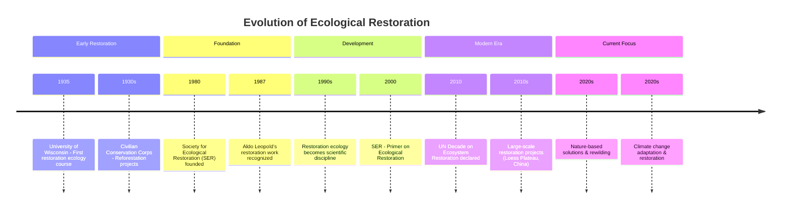

```mermaid
timeline
    title Evolution of Ecological Restoration
    section Early Restoration
        1935 : University of Wisconsin - First restoration ecology course
        1930s : Civilian Conservation Corps - Reforestation projects
    section Foundation
        1980 : Society for Ecological Restoration (SER) founded
        1987 : Aldo Leopold's restoration work recognized
    section Development
        1990s : Restoration ecology becomes scientific discipline
        2000 : SER - Primer on Ecological Restoration
    section Modern Era
        2010 : UN Decade on Ecosystem Restoration declared
        2010s : Large-scale restoration projects (Loess Plateau, China)
    section Current Focus
        2020s : Nature-based solutions & rewilding
        2020s : Climate change adaptation & restoration
```
