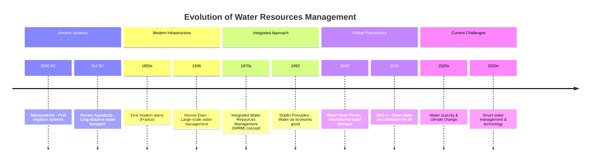

```mermaid
timeline
    title Evolution of Water Resources Management
    section Ancient Systems
        3000 BC : Mesopotamia - First irrigation systems
        312 BC : Roman Aqueducts - Long-distance water transport
    section Modern Infrastructure
        1850s : First modern dams (France)
        1936 : Hoover Dam - Large-scale water management
    section Integrated Approach
        1970s : Integrated Water Resources Management (IWRM) concept
        1992 : Dublin Principles - Water as economic good
    section Global Frameworks
        2000 : World Water Forum - International water dialogue
        2015 : SDG 6 - Clean water and sanitation for all
    section Current Challenges
        2020s : Water scarcity & climate change
        2020s : Smart water management & technology
```
