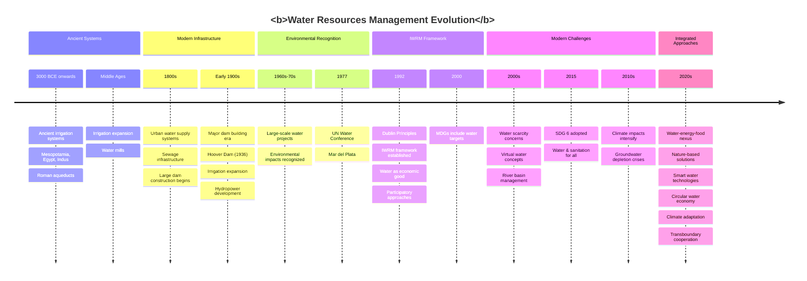

```mermaid
timeline
    title <b>Water Resources Management Evolution</b>
    
    section Ancient Systems
        3000 BCE onwards : Ancient irrigation systems
                         : Mesopotamia, Egypt, Indus
                         : Roman aqueducts
        Middle Ages : Irrigation expansion
                    : Water mills
    
    section Modern Infrastructure
        1800s : Urban water supply systems
              : Sewage infrastructure
              : Large dam construction begins
        Early 1900s : Major dam building era
                    : Hoover Dam (1936)
                    : Irrigation expansion
                    : Hydropower development
    
    section Environmental Recognition
        1960s-70s : Large-scale water projects
                  : Environmental impacts recognized
        1977  : UN Water Conference
              : Mar del Plata
    
    section IWRM Framework
        1992  : Dublin Principles
              : IWRM framework established
              : Water as economic good
              : Participatory approaches
        2000  : MDGs include water targets
    
    section Modern Challenges
        2000s : Water scarcity concerns
              : Virtual water concepts
              : River basin management
        2015  : SDG 6 adopted
              : Water & sanitation for all
        2010s : Climate impacts intensify
              : Groundwater depletion crises
    
    section Integrated Approaches
        2020s : Water-energy-food nexus
              : Nature-based solutions
              : Smart water technologies
              : Circular water economy
              : Climate adaptation
              : Transboundary cooperation
```
