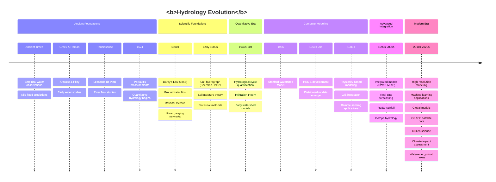

```mermaid
timeline
    title <b>Hydrology Evolution</b>
    
    section Ancient Foundations
        Ancient Times : Empirical water observations
                      : Nile flood predictions
        Greek & Roman : Aristotle & Pliny
                      : Early water studies
        Renaissance : Leonardo da Vinci
                    : River flow studies
        1674  : Perrault's measurements
              : Quantitative hydrology begins
    
    section Scientific Foundations
        1800s : Darcy's Law (1856)
              : Groundwater flow
              : Rational method
              : River gauging networks
        Early 1900s : Unit hydrograph (Sherman, 1932)
                    : Soil moisture theory
                    : Statistical methods
    
    section Quantitative Era
        1940s-50s : Hydrological cycle quantification
                  : Infiltration theory
                  : Early watershed models
    
    section Computer Modeling
        1966  : Stanford Watershed Model
        1960s-70s : HEC-1 development
                  : Distributed models emerge
        1980s : Physically-based modeling
              : GIS integration
              : Remote sensing applications
    
    section Advanced Integration
        1990s-2000s : Integrated models (SWAT, MIKE)
                    : Real-time forecasting
                    : Radar rainfall
                    : Isotope hydrology
    
    section Modern Era
        2010s-2020s : High-resolution modeling
                    : Machine learning applications
                    : Global models
                    : GRACE satellite data
                    : Citizen science
                    : Climate impact assessment
                    : Water-energy-food nexus
```
