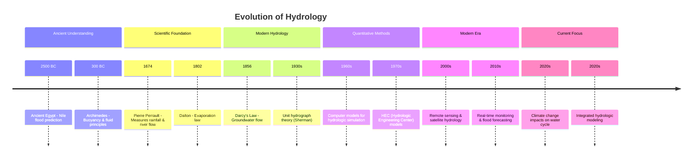

```mermaid
timeline
    title Evolution of Hydrology
    section Ancient Understanding
        2500 BC : Ancient Egypt - Nile flood prediction
        300 BC : Archimedes - Buoyancy & fluid principles
    section Scientific Foundation
        1674 : Pierre Perrault - Measures rainfall & river flow
        1802 : Dalton - Evaporation law
    section Modern Hydrology
        1856 : Darcy's Law - Groundwater flow
        1930s : Unit hydrograph theory (Sherman)
    section Quantitative Methods
        1960s : Computer models for hydrologic simulation
        1970s : HEC (Hydrologic Engineering Center) models
    section Modern Era
        2000s : Remote sensing & satellite hydrology
        2010s : Real-time monitoring & flood forecasting
    section Current Focus
        2020s : Climate change impacts on water cycle
        2020s : Integrated hydrologic modeling
```
