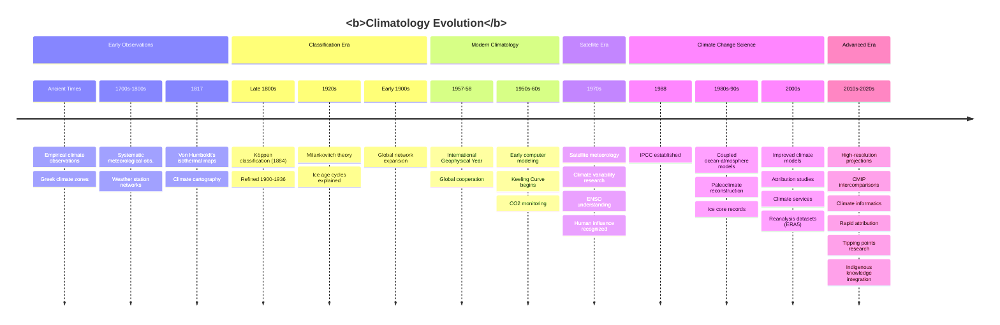

```mermaid
timeline
    title <b>Climatology Evolution</b>
    
    section Early Observations
        Ancient Times : Empirical climate observations
                      : Greek climate zones
        1700s-1800s : Systematic meteorological obs.
                    : Weather station networks
        1817  : Von Humboldt's isothermal maps
              : Climate cartography
    
    section Classification Era
        Late 1800s : Köppen classification (1884)
                   : Refined 1900-1936
        1920s : Milankovitch theory
              : Ice age cycles explained
        Early 1900s : Global network expansion
    
    section Modern Climatology
        1957-58 : International Geophysical Year
                : Global cooperation
        1950s-60s : Early computer modeling
                  : Keeling Curve begins
                  : CO2 monitoring
    
    section Satellite Era
        1970s : Satellite meteorology
              : Climate variability research
              : ENSO understanding
              : Human influence recognized
    
    section Climate Change Science
        1988  : IPCC established
        1980s-90s : Coupled ocean-atmosphere models
                  : Paleoclimate reconstruction
                  : Ice core records
        2000s : Improved climate models
              : Attribution studies
              : Climate services
              : Reanalysis datasets (ERA5)
    
    section Advanced Era
        2010s-2020s : High-resolution projections
                    : CMIP intercomparisons
                    : Climate informatics
                    : Rapid attribution
                    : Tipping points research
                    : Indigenous knowledge integration
```
