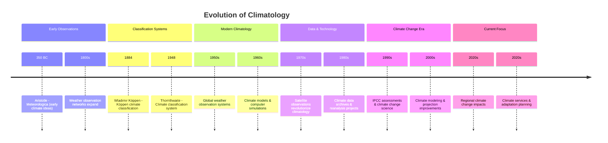

```mermaid
timeline
    title Evolution of Climatology
    section Early Observations
        350 BC : Aristotle - Meteorologica (early climate ideas)
        1800s : Weather observation networks expand
    section Classification Systems
        1884 : Wladimir Köppen - Köppen climate classification
        1948 : Thornthwaite - Climate classification system
    section Modern Climatology
        1950s : Global weather observation systems
        1960s : Climate models & computer simulations
    section Data & Technology
        1970s : Satellite observations revolutionize climatology
        1980s : Climate data archives & reanalysis projects
    section Climate Change Era
        1990s : IPCC assessments & climate change science
        2000s : Climate modeling & projection improvements
    section Current Focus
        2020s : Regional climate change impacts
        2020s : Climate services & adaptation planning
```
