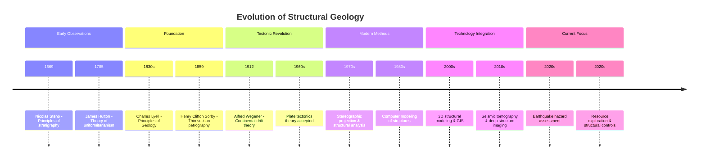

```mermaid
timeline
    title Evolution of Structural Geology
    section Early Observations
        1669 : Nicolas Steno - Principles of stratigraphy
        1785 : James Hutton - Theory of uniformitarianism
    section Foundation
        1830s : Charles Lyell - Principles of Geology
        1859 : Henry Clifton Sorby - Thin section petrography
    section Tectonic Revolution
        1912 : Alfred Wegener - Continental drift theory
        1960s : Plate tectonics theory accepted
    section Modern Methods
        1970s : Stereographic projection & structural analysis
        1980s : Computer modeling of structures
    section Technology Integration
        2000s : 3D structural modeling & GIS
        2010s : Seismic tomography & deep structure imaging
    section Current Focus
        2020s : Earthquake hazard assessment
        2020s : Resource exploration & structural controls
```
