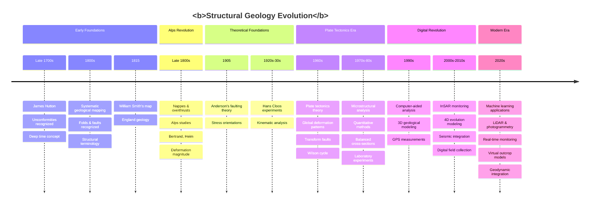

```mermaid
timeline
    title <b>Structural Geology Evolution</b>
    
    section Early Foundations
        Late 1700s : James Hutton
                   : Unconformities recognized
                   : Deep time concept
        1800s : Systematic geological mapping
              : Folds & faults recognized
              : Structural terminology
        1815  : William Smith's map
              : England geology
    
    section Alps Revolution
        Late 1800s : Nappes & overthrusts
                   : Alps studies
                   : Bertrand, Heim
                   : Deformation magnitude
    
    section Theoretical Foundations
        1905  : Anderson's faulting theory
              : Stress orientations
        1920s-30s : Hans Cloos experiments
                  : Kinematic analysis
    
    section Plate Tectonics Era
        1960s : Plate tectonics theory
              : Global deformation patterns
              : Transform faults
              : Wilson cycle
        1970s-80s : Microstructural analysis
                  : Quantitative methods
                  : Balanced cross-sections
                  : Laboratory experiments
    
    section Digital Revolution
        1990s : Computer-aided analysis
              : 3D geological modeling
              : GPS measurements
        2000s-2010s : InSAR monitoring
                    : 4D evolution modeling
                    : Seismic integration
                    : Digital field collection
    
    section Modern Era
        2020s : Machine learning applications
              : LiDAR & photogrammetry
              : Real-time monitoring
              : Virtual outcrop models
              : Geodynamic integration
```
