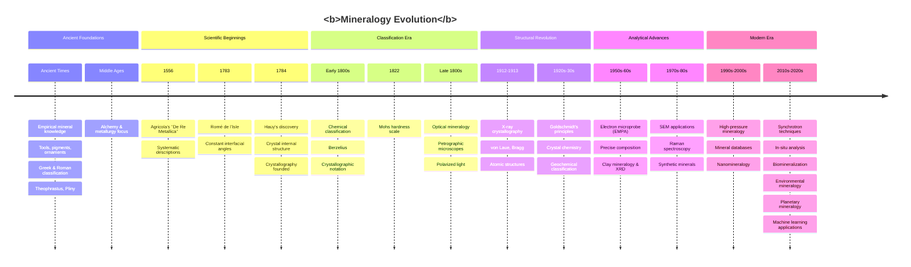

```mermaid
timeline
    title <b>Mineralogy Evolution</b>
    
    section Ancient Foundations
        Ancient Times : Empirical mineral knowledge
                      : Tools, pigments, ornaments
                      : Greek & Roman classification
                      : Theophrastus, Pliny
        Middle Ages : Alchemy & metallurgy focus
    
    section Scientific Beginnings
        1556  : Agricola's "De Re Metallica"
              : Systematic descriptions
        1783  : Romé de l'Isle
              : Constant interfacial angles
        1784  : Haüy's discovery
              : Crystal internal structure
              : Crystallography founded
    
    section Classification Era
        Early 1800s : Chemical classification
                    : Berzelius
                    : Crystallographic notation
        1822  : Mohs hardness scale
        Late 1800s : Optical mineralogy
                   : Petrographic microscopes
                   : Polarized light
    
    section Structural Revolution
        1912-1913 : X-ray crystallography
                  : von Laue, Bragg
                  : Atomic structures
        1920s-30s : Goldschmidt's principles
                  : Crystal chemistry
                  : Geochemical classification
    
    section Analytical Advances
        1950s-60s : Electron microprobe (EMPA)
                  : Precise composition
                  : Clay mineralogy & XRD
        1970s-80s : SEM applications
                  : Raman spectroscopy
                  : Synthetic minerals
    
    section Modern Era
        1990s-2000s : High-pressure mineralogy
                    : Mineral databases
                    : Nanomineralogy
        2010s-2020s : Synchrotron techniques
                    : In-situ analysis
                    : Biomineralization
                    : Environmental mineralogy
                    : Planetary mineralogy
                    : Machine learning applications
```
