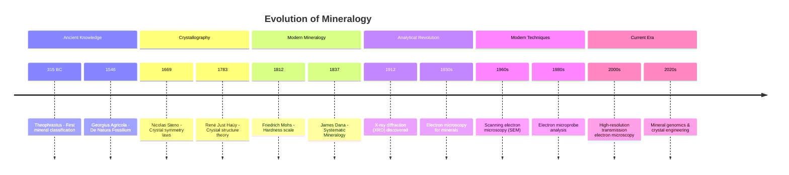

```mermaid
timeline
    title Evolution of Mineralogy
    section Ancient Knowledge
        315 BC : Theophrastus - First mineral classification
        1546 : Georgius Agricola - De Natura Fossilium
    section Crystallography
        1669 : Nicolas Steno - Crystal symmetry laws
        1783 : René Just Haüy - Crystal structure theory
    section Modern Mineralogy
        1812 : Friedrich Mohs - Hardness scale
        1837 : James Dana - Systematic Mineralogy
    section Analytical Revolution
        1912 : X-ray diffraction (XRD) discovered
        1930s : Electron microscopy for minerals
    section Modern Techniques
        1960s : Scanning electron microscopy (SEM)
        1980s : Electron microprobe analysis
    section Current Era
        2000s : High-resolution transmission electron microscopy
        2020s : Mineral genomics & crystal engineering
```
