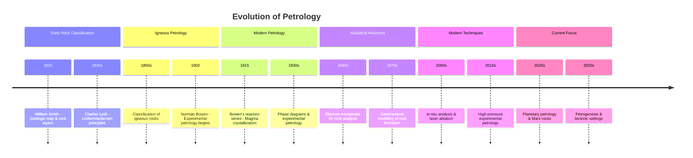

```mermaid
timeline
    title Evolution of Petrology
    section Early Rock Classification
        1815 : William Smith - Geologic map & rock layers
        1830s : Charles Lyell - Uniformitarianism principles
    section Igneous Petrology
        1850s : Classification of igneous rocks
        1902 : Norman Bowen - Experimental petrology begins
    section Modern Petrology
        1915 : Bowen's reaction series - Magma crystallization
        1930s : Phase diagrams & experimental petrology
    section Analytical Advances
        1960s : Electron microprobe for rock analysis
        1970s : Geochemical modeling of rock formation
    section Modern Techniques
        2000s : In-situ analysis & laser ablation
        2010s : High-pressure experimental petrology
    section Current Focus
        2020s : Planetary petrology & Mars rocks
        2020s : Petrogenesis & tectonic settings
```
