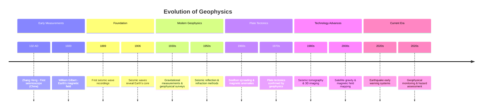

```mermaid
timeline
    title Evolution of Geophysics
    section Early Measurements
        132 AD : Zhang Heng - First seismoscope (China)
        1600 : William Gilbert - Earth's magnetic field
    section Foundation
        1889 : First seismic wave recordings
        1906 : Seismic waves reveal Earth's core
    section Modern Geophysics
        1930s : Gravitational measurements & geophysical surveys
        1950s : Seismic reflection & refraction methods
    section Plate Tectonics
        1960s : Seafloor spreading & magnetic anomalies
        1970s : Plate tectonics confirmed by geophysics
    section Technology Advances
        1980s : Seismic tomography & 3D imaging
        2000s : Satellite gravity & magnetic field mapping
    section Current Era
        2020s : Earthquake early warning systems
        2020s : Geophysical monitoring & hazard assessment
```
