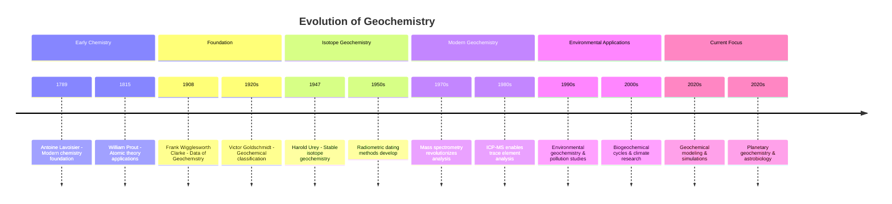

```mermaid
timeline
    title Evolution of Geochemistry
    section Early Chemistry
        1789 : Antoine Lavoisier - Modern chemistry foundation
        1815 : William Prout - Atomic theory applications
    section Foundation
        1908 : Frank Wigglesworth Clarke - Data of Geochemistry
        1920s : Victor Goldschmidt - Geochemical classification
    section Isotope Geochemistry
        1947 : Harold Urey - Stable isotope geochemistry
        1950s : Radiometric dating methods develop
    section Modern Geochemistry
        1970s : Mass spectrometry revolutionizes analysis
        1980s : ICP-MS enables trace element analysis
    section Environmental Applications
        1990s : Environmental geochemistry & pollution studies
        2000s : Biogeochemical cycles & climate research
    section Current Focus
        2020s : Geochemical modeling & simulations
        2020s : Planetary geochemistry & astrobiology
```
