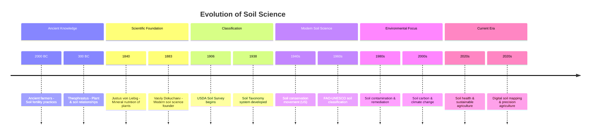

```mermaid
timeline
    title Evolution of Soil Science
    section Ancient Knowledge
        2000 BC : Ancient farmers - Soil fertility practices
        300 BC : Theophrastus - Plant & soil relationships
    section Scientific Foundation
        1840 : Justus von Liebig - Mineral nutrition of plants
        1883 : Vasily Dokuchaev - Modern soil science founder
    section Classification
        1906 : USDA Soil Survey begins
        1938 : Soil Taxonomy system developed
    section Modern Soil Science
        1940s : Soil conservation movement (US)
        1960s : FAO-UNESCO soil classification
    section Environmental Focus
        1980s : Soil contamination & remediation
        2000s : Soil carbon & climate change
    section Current Era
        2020s : Soil health & sustainable agriculture
        2020s : Digital soil mapping & precision agriculture
```
